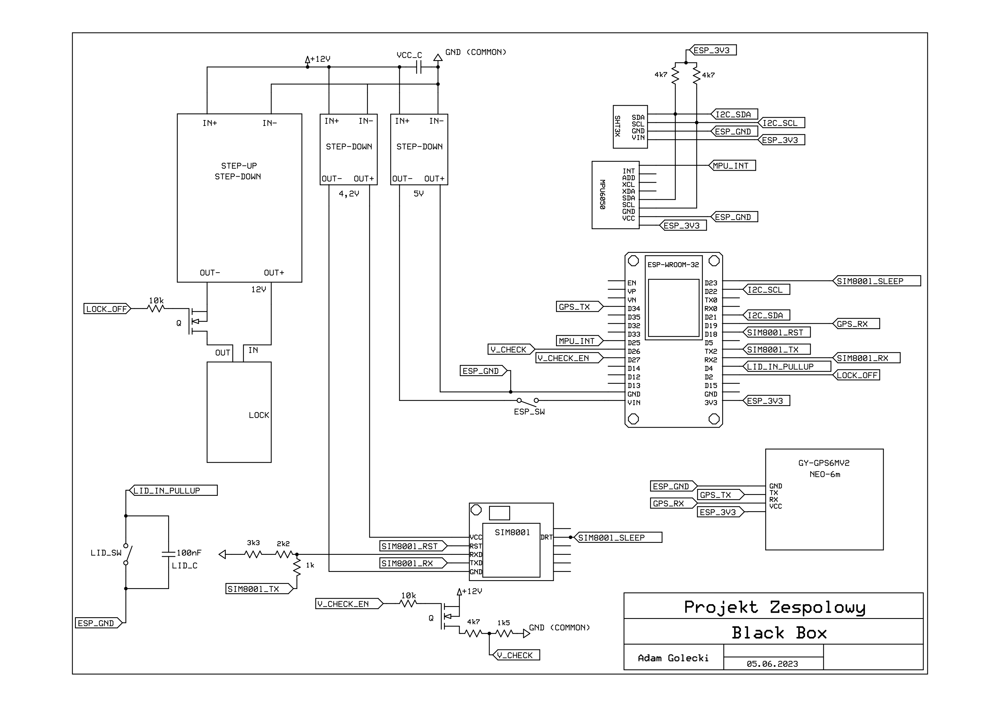

# By The Way Logistics - Device

The device part of the project.

**As a result of this subproject a fully-functional device was created.**
**Unfortunately because of very limited time, difficult to meet requirements and too few participants there are some bugs in the project.**
**Please keep that in mind.**

The aim of this subproject was to create a device (sealed inside the specially prepared ***container***) that could be used for monitoring the transportation of the goods, including:
- checking temperature and humidity inside the container,
- careless handling of the container and its contents (by using accelerometer),
- sending GPS coordinates of its current location,
- detecting unauthorized opening of the container and send a warning to the server

The device also had to:
- allow user to open the container,
- send all data mentioned above in for of a JSON, that could be understood by the server.

The data was sent by the device by a GPRS network (using a SIM800 module).

At the end, the mentioned (openable/closable) container was equipped:
- electric lock (used to lock the lid by the device),
- 12V battery (used to power the device),
- the device itself (including the microcontroller and all the nessesary modules).

## Tools
1) Programming language
   - C/C++,
2) ESP32 programming environment:
   - ESP-IDF.

## Libraries
The following libraries were used:
1) [I2Cdev](https://github.com/jrowberg/i2cdevlib), including the MPU6050 library:
   - MPU6050 support,
2) [minmea]([minmea](https://github.com/kosma/minmea)):
    - NMEA0183 message parser,
3) [cJSON](https://github.com/DaveGamble/cJSON):
   - JSON format parser, used to create messages sent to and received from the server,
4) Catch2 v3:
   - unit tests.

Libraries for other used modules (SIM800l, SHT30, NEO-6m) were written exclusively for this project as other libraries did not provide expected functionality or had a license other than MIT (and could not be used for any potentially commercial product).

## Project structure
The main loop of the program can be found in [main directory](./main/).

Other components can be found in [components directory](./components/).
This directory contains:
- libraries described in [section above](#libraries):
  - [I2Cdev](./components/I2Cdev/) and [MPU6050](./components/MPU6050/) (must be used together),
  - [minmea](./components/minmea/),
  - [cJSON](./components/cJSON/),
- other ones used by main and created exclusively for the device.

For every component (including the libraries) the CMakeLists.txt file was created [as recommended by the manufacturer](https://docs.espressif.com/projects/esp-idf/en/stable/esp32/api-guides/build-system.html).

## Hardware
Hardware components used in the project:
1) electric lock:
   - powered by 12 volts,
2) external flat button:
   - used to wake up the device before the specified "wake-up time" and download data from the server,
3) contactor:
   - Checking the flap closure,
4) ESP32 DEVKIT V1:
   - main unit,
5) SIM800l:
   - low-cost module for communication via GSM/GPRS cellular network,
6)  MPU6050:
    - accelerometer,
7)  SHT3X:
    - reading the temperature and humidity inside the transport container,
8)  NEO-6m-000-01:
    - GPS coordinate reading module,
9)  step-up/step-down converter:
    - used to provide 12 V power to the electric lock,
10) two step-down inverters (MPI581):
    - serve to provide a constant 5 V supply from ESP32 and 4.2 V to SIM800l,
11) two N-THT IRLB8721 H241/R AA03 transistors:
    - one used to open the electric lock,
    - one used to disable the voltage divider (used to read the battery voltage).

