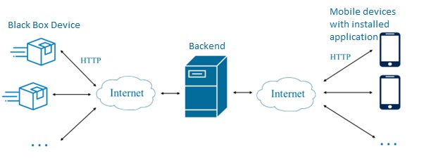

# By The Way Logistics - Backend 
The backend part of the project.

The purpose of this API is to provide communication between users and transport containers. 
It handles queries sent from users and, based on them, returns information stored in the database about available orders, parcels sent by the user and parcels received by the user, their status, etc.
The API handles all the logic of the system, the application only sends requests, the transport container executes the commands issued by the API. 

The API follows REST API architectural style.
All requests use JSON format.

.

Full documentation can be found in [backend documentation](./resources/backend_doc_pl.pdf).
The original repository can be found [here](https://github.com/dominicus28/BTWL/tree/backend).

## Tools
Tools used by the backend are listed below:
1. API framework:
   - Spring Boot:
       - framework for developing applications,
       - programming language: Java,
2. Database:
   - MongoDB database:
       - non-relational database,
       - cloud solution.

## Endpoints
All the endpoints can be found in [backend documentation](./resources/backend_doc_pl.pdf).
